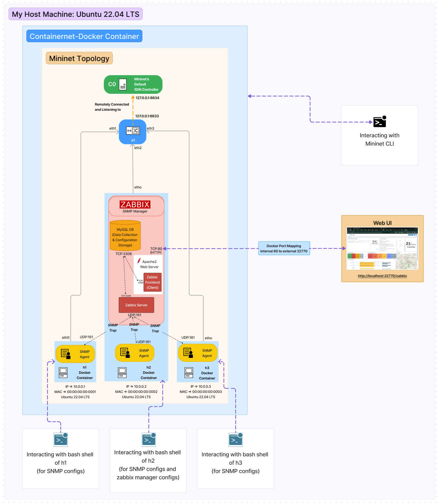

---

# Quick Start Configurations for Mininet-Containernet Topology with Zabbix SNMP Manager



## 1. Setting up Environment (Linux env is preferred)
1.1 Clone this repo & CD to `/Lab11/`
```bash
git clone https://github.com/KalinduWijerathna/CO515-Advanced-Networking-Labs-2024.git
cd Lab11
```
1.2 Install Docker and Docker Compose
```bash
sudo apt-get update
sudo apt-get install -y docker.io docker-compose
```

## 2. Setting up Containernet
2.1 Clone the Containernet repository & CD to `./containernet`
```bash
git clone https://github.com/containernet/containernet.git
cd containernet
```
2.2 Build the Containernet Docker image
```bash
docker build -t containernet/containernet .
```
2.3 Run the Containernet Docker container
```bash
docker run --name containernet -it --rm --privileged --pid='host' -v /var/run/docker.sock:/var/run/docker.sock containernet/containernet /bin/bash
```
2.4 Inside the Containernet Docker container:
   - i) Open `/containernet/mininet/node.py` and change the value of the `cgroup-parent` variable 
   from: `/docker`  
   to: `docker.slice`

   - ii) Check if Mininet works by running:
   ```bash
   sudo python3 examples/containernet_example.py
   ```
   - iii) If not, try the following:
     Create a file `/etc/docker/daemon.json` with the following content:
     ```json
     {
       "exec-opts": ["native.cgroupdriver=cgroupfs"]
     }
     ```
     Restart Docker service:
     ```bash
     sudo systemctl enable docker
     sudo systemctl daemon-reload
     sudo systemctl restart docker
     ```
     (If `systemctl` did not work, try service commands e.g., `/etc/init.d/dockerd restart`)

   - ii) Check again if Mininet works by running:
   ```bash
   sudo python3 examples/containernet_example.py
   ```

**Make sure to always stop and remove Docker containers of the Mininet hosts regarding previously ran Mininet topologies.**

## 3. Running the Mininet Topology
Using `docker cp` commands or manually creating a file inside the Containernet Docker container, copy the file `my_topo.py` in this repo into `/containernet/examples/`. Enhance the topology and play along with different network configurations. Then run the topology by:
```bash
python3 my_topo.py
```
Ensure that all the Mininet hosts have created corresponding Docker containers by running `docker ps` locally on your machine.

## 4. Configuring Mininet Hosts for SNMP
(The process is the same for all three hosts.)
Start a new terminal tab locally and enter the following:
4.1 Access the Mininet host's container:
```bash
docker exec -it mn.<host-name(h1,h2,h3)> /bin/bash
```
4.2 Check if SNMP is successfully running by:
```bash
netstat -tulpn | grep 161
```
(This should show something like `udp 127.0.0.1:161`, which means the host is only listening to local UDP connections. Now we have to change this to `0.0.0.0:161` or `SNMP_Manager_IP:161` to set up external SNMP connections.)

4.3 Edit `/etc/snmp/snmpd.conf` file for allowing external access for this SNMP agent:
Copy and paste the content of `./Lab11/snmpd-for-zabbix-conn.conf` (use `./Lab11/snmpd.conf` if checking without Zabbix).

4.4 Restart the SNMP daemon:
   - i) Try the following and check if `netstat -tulpn | grep 161` output has changed to `udp 0.0.0.0:161`:
   ```bash
   /etc/init.d/snmpd restart
   ```
   - ii) If it did not work, manually kill the SNMP process:
     a. Find the process number of SNMP:
     ```bash
     ps
     ```
     b. Kill the process:
     ```bash
     kill <process-number>
     ```
     c. Restart SNMP:
     ```bash
     /etc/init.d/snmpd start
     ```
     d. Verify by:
     ```bash
     netstat -tulpn | grep 161
     ```

Repeat the same steps for all hosts.

## 5. Setting up Zabbix
5.1 Access `mn.h2`'s terminal:
```bash
docker exec -it mn.h2 /bin/bash
```
5.2 Install MySQL server:
```bash
apt-get update
apt-get install mysql-server
mysql_secure_installation
# Provide password and configure as prompted.
```
Restart MySQL server:
```bash
/etc/init.d/mysql restart
```

5.3 Download and set up Zabbix:
Refer to the Zabbix [installation guide](https://www.zabbix.com/download?zabbix=7.0&os_distribution=ubuntu&os_version=22.04&components=server_frontend_agent&db=mysql&ws=apache) for detailed steps.

### Install Zabbix repository:
```bash
wget https://repo.zabbix.com/zabbix/7.0/ubuntu/pool/main/z/zabbix-release/zabbix-release_7.0-1+ubuntu22.04_all.deb
dpkg -i zabbix-release_7.0-1+ubuntu22.04_all.deb
apt update
```
### Install Zabbix server, frontend, and agent:
```bash
apt install zabbix-server-mysql zabbix-frontend-php zabbix-apache-conf zabbix-sql-scripts zabbix-agent
```
### Create initial database:
```bash
mysql -uroot -p
# Provide the MySQL root password.
mysql> create database zabbix character set utf8mb4 collate utf8mb4_bin;
mysql> create user zabbix@localhost identified by 'password';
mysql> grant all privileges on zabbix.* to zabbix@localhost;
mysql> set global log_bin_trust_function_creators = 1;
mysql> quit;
```
On Zabbix server host, import initial schema and data:
```bash
zcat /usr/share/zabbix-sql-scripts/mysql/server.sql.gz | mysql --default-character-set=utf8mb4 -uzabbix -p zabbix
```
Disable `log_bin_trust_function_creators` option after importing database schema:
```bash
mysql -uroot -p
# Provide the MySQL root password.
mysql> set global log_bin_trust_function_creators = 0;
mysql> quit;
```
### Configure the database for Zabbix server:
Edit `/etc/zabbix/zabbix_server.conf`:
```bash
DBPassword=password
```
### Start Zabbix server and agent processes:
```bash
/etc/init.d/zabbix-server start
/etc/init.d/zabbix-agent start 
/etc/init.d/apache2 start
```
### Open Zabbix UI web page:
The default URL for Zabbix UI when using Apache web server is `http://localhost:32770/zabbix` (double-check the port number using `docker ps` on local and check the mapped port for h2 container's internal port 80).

5.5 Open the Zabbix Client UI through a browser:
  - Continue with the Zabbix setup.
  - If Zabbix server has trouble finding a compatible language (like `en_US`), run the following:
  ```bash
  apt-get install locales
  dpkg-reconfigure locales
  ```
  Select `en_US.UTF-8` from the list that appears during configuration.
  Edit `/etc/default/locale`:
  ```bash
  LANG=en_US.UTF-8
  LC_ALL=en_US.UTF-8
  ```
  Make sure to restart or stop & start Zabbix server, client, Apache2, and MySQL when necessary.

Additionally, refer to this [YouTube tutorial by Zabbix](https://youtu.be/87CdcPyBTr4?si=VuUjhOYXtHOnfiod) and further customize this setup according to your specific requirements.

---
